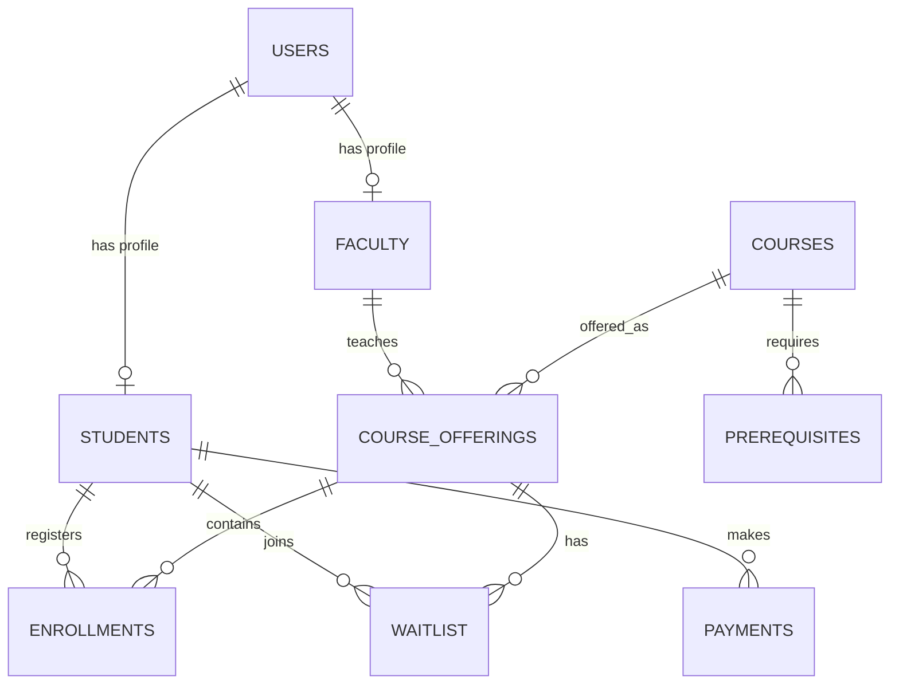

# 🎓 Online Course Registration Portal

> **A normalized MySQL database system for academic course registration, enrollment, prerequisites, waitlists, grades, payments, notifications, and role-based access.**


## 📌 Project Overview

The **Online Course Registration Portal** is a Database Management Systems (DBMS) Project Based Learning project designed around an academic course-registration workflow for GCET.

The database models three major roles:

- **Student** — browse courses, check prerequisites, enroll, join waitlists, view grades/CGPA, make payments, and receive notifications.
- **Faculty** — manage course offerings, monitor enrollment, view students, update grades, and communicate announcements.
- **Admin** — manage the course catalog, oversee registrations, generate reports, manage users/roles, handle waitlists, and track payments.

The project applies relational database concepts including **3NF normalization, primary/foreign keys, joins, aggregations, subqueries, DDL, DML, DCL, and TCL**.

---

## 🎯 Problem Statement

A course-registration system has to coordinate students, faculty, courses, offerings, prerequisites, capacity, waitlists, grades, and payments without duplicating data or losing referential consistency.

This project models those workflows as a structured relational database so that academic operations can be queried, maintained, and extended systematically.

---

## ✨ Key Features

| Feature | Description |
|---|---|
| 👤 Role Management | Student, Faculty, and Admin roles |
| 📚 Course Catalog | Course code, name, credits, department, semester |
| 🗓️ Course Offerings | Faculty, semester, year, capacity, schedule |
| ✅ Prerequisites | Required courses and minimum grades |
| 📝 Enrollment | Registration status, enrollment date, and grades |
| ⏳ Waitlist | Queue position and promotion status |
| 💳 Payments | Semester payment amount and status |
| 🔔 Notifications | Student, faculty, and system-wide notifications |
| 📊 Analytics | Enrollment, availability, CGPA, teaching-load, and payment reports |
| 🔐 Access Control | DCL and role-oriented access model |

---

## 🧠 Database Architecture



### Core tables

```text
users
├── students
└── faculty

courses
├── course_offerings
└── prerequisites

students
├── enrollments
├── waitlist
└── payments

notifications
```

The full academic ER diagram is documented in [`diagrams/ER_DIAGRAM.md`](diagrams/ER_DIAGRAM.md).

---

## 🔄 Functional Workflows

### Student

```text
Login
  ↓
Browse Courses
  ↓
Check Prerequisites
  ↓
Seat Available? ── No ──→ Join Waitlist
  │
 Yes
  ↓
Enroll
  ↓
View Schedule / Grades
  ↓
Track CGPA + Payments
```

### Faculty

```text
Manage Offering
      ↓
Monitor Enrollment
      ↓
View Students
      ↓
Update Grades
      ↓
Publish Announcements
```

### Admin

```text
Manage Catalog
      ↓
Manage Users & Roles
      ↓
Monitor Registrations
      ↓
Handle Waitlists
      ↓
Generate Reports
      ↓
Track Payments
```

---

## 🗃️ Relational Schema

### `users`

Stores common identity, contact, authentication-role, and registration information.

### `students`

Stores student-specific academic information such as roll number, semester, department, and CGPA.

### `faculty`

Stores faculty department, designation, and specialization.

### `courses`

Stores reusable course-catalog information.

### `course_offerings`

Represents a particular course being offered in a semester/year with faculty, capacity, and schedule.

### `prerequisites`

Models course-to-course prerequisite relationships and minimum grades.

### `enrollments`

Records the relationship between students and course offerings, including status and grade.

### `waitlist`

Stores students waiting for a seat in a full course offering.

### `payments`

Stores semester-level payment records.

### `notifications`

Stores academic/system notifications and recipient categories.

---

## 🧩 Normalization

The project report describes the schema using **Third Normal Form (3NF)**.

### 1NF — Atomicity

Attributes contain atomic values rather than repeating groups.

### 2NF — Full Dependency

Non-key attributes depend on their complete key.

### 3NF — Reduced Transitive Dependency

Related information is represented through foreign-key relationships instead of repeatedly storing the same entity details.

For example:

```text
course_offerings.faculty_id
            ↓
      faculty.faculty_id
            ↓
         users.user_id
```

This keeps faculty identity and profile data separated from course-offering records.

---

## 🛠️ SQL Concepts Demonstrated

### DDL — Data Definition Language

```sql
CREATE
ALTER
DROP
TRUNCATE
```

### DML — Data Manipulation Language

```sql
SELECT
INSERT
UPDATE
DELETE
```

### DCL — Data Control Language

```sql
GRANT
REVOKE
```

### TCL — Transaction Control Language

```sql
COMMIT
ROLLBACK
SAVEPOINT
```

The corresponding examples are in [`database/ddl_dcl_tcl.sql`](database/ddl_dcl_tcl.sql).

---

## 🔎 Example SQL

### Seat Availability

```sql
SELECT c.course_name,
       co.max_capacity,
       co.current_enrollment,
       (co.max_capacity - co.current_enrollment) AS seats_available
FROM course_offerings co
JOIN courses c ON co.course_id = c.course_id
WHERE co.semester = 1
  AND co.year = 2025;
```

### Waitlist Position

```sql
SELECT s.roll_number,
       u.name,
       c.course_name,
       w.position,
       w.added_date
FROM waitlist w
JOIN students s ON w.student_id = s.student_id
JOIN users u ON s.user_id = u.user_id
JOIN course_offerings co ON w.offering_id = co.offering_id
JOIN courses c ON co.course_id = c.course_id
WHERE w.status = 'WAITING'
ORDER BY c.course_name, w.position;
```

### Faculty Teaching Load

```sql
SELECT u.name AS faculty_name,
       f.department,
       COUNT(co.offering_id) AS courses_teaching,
       SUM(co.current_enrollment) AS total_students
FROM faculty f
JOIN users u ON f.user_id = u.user_id
JOIN course_offerings co ON f.faculty_id = co.faculty_id
WHERE co.semester = 1
  AND co.year = 2025
GROUP BY f.faculty_id, u.name, f.department;
```

More queries are available in [`queries/queries.sql`](queries/queries.sql).

---

## 🚀 Getting Started

### Requirements

- **MySQL 8.x** recommended
- MySQL Workbench or MySQL CLI

### 1. Create the database

```sql
CREATE DATABASE online_course_registration;
USE online_course_registration;
```

### 2. Create tables

Run:

```text
database/schema.sql
```

### 3. Load demonstration data

Run:

```text
database/sample_data.sql
```

### 4. Run queries

Run:

```text
queries/queries.sql
```

### 5. Explore transactions and access control

Review:

```text
database/ddl_dcl_tcl.sql
```

> The SQL files are intended as an academic demonstration. Review privileges and credentials before using any part of the project in a real deployment.

---

## 📁 Repository Structure

```text
online-course-registration-portal/
│
├── README.md
├── .gitignore
│
├── database/
│   ├── schema.sql
│   ├── sample_data.sql
│   └── ddl_dcl_tcl.sql
│
├── queries/
│   └── queries.sql
│
├── diagrams/
│   └── ER_DIAGRAM.md
│
└── docs/
    └── DBMS_PBL_Report.docx
```

---

## 🔐 Security Notes

The academic report discusses secure authentication, role-based access, DCL, parameterized queries, and password hashing through the JDBC/application layer.

The repository therefore treats the included records as **demonstration data only**.

The sample SQL intentionally uses `DEMO_ONLY_*` password placeholders rather than reusable real credentials.

For a production system:

- use a modern password-hashing algorithm
- never store plaintext passwords
- use prepared/parameterized statements
- restrict database privileges by role
- validate all user-controlled input
- keep secrets outside source control

---

## 📈 Reporting & Analytics

The schema supports analytical queries for:

- course popularity
- available seats
- student enrollment history
- prerequisite eligibility
- waitlist positions
- calculated CGPA
- faculty teaching load
- semester-wise enrollment
- pending payments

This demonstrates how the same relational model can support both **transactional operations and institutional reporting**.

---

## ⚠️ Scope & Limitations

This repository represents the **database layer and academic DBMS design** described in the project report.

The report references JDBC and Java Servlets as the intended backend/application integration layer; this repository does not claim to provide a complete production web application.

Automatic waitlist promotion, schedule-conflict handling, and other business rules are described as system features in the report, but their complete trigger/procedure implementation is not present in the supplied report SQL. They are therefore documented as project scope rather than represented here as completed database automation.

---

## 🔮 Future Scope

The report proposes extensions including:

- AI-based course recommendations
- analytics dashboards
- mobile integration
- automated schedule optimization
- real-time notifications
- payment-gateway integration
- course ratings and feedback
- automated transcript generation
- multi-campus support

---

## 🎓 Academic Context

**Project:** Online Course Registration Portal  
**Course:** Database Management Systems — Project Based Learning  
**Institution:** Geethanjali College of Engineering and Technology  
**Department:** CSE (Artificial Intelligence & Machine Learning)  
**Academic Year:** 2024–2025  
**Faculty Guide:** Dr. K. Arpitha

### Team

- M. Tejaswini — 24R11A6668
- V. Vaishnavi — 24R11A6699
- Tanvi Patil — 24R11A6696
- N. Shreya — 24R11A6676

---

## 📚 References

The project report references standard database texts and documentation including:

- Elmasri & Navathe — *Fundamentals of Database Systems*
- Rob & Coronel — *Database Systems: Design, Implementation, & Management*
- Harrington — *Relational Database Design and Implementation*
- C. J. Date — *An Introduction to Database Systems*
- Connolly & Begg — *Database Systems: A Practical Approach*
- MySQL Documentation
- OWASP SQL Injection Prevention Cheat Sheet

The complete academic report is preserved under [`docs/DBMS_PBL_Report.docx`](docs/DBMS_PBL_Report.docx).

---

## 👥 Contributors

**M. Tejaswini · V. Vaishnavi · Tanvi Patil · N. Shreya**

---

> **Academic project — built to demonstrate relational database design, SQL, normalization, integrity constraints, access control, and analytical querying.**
